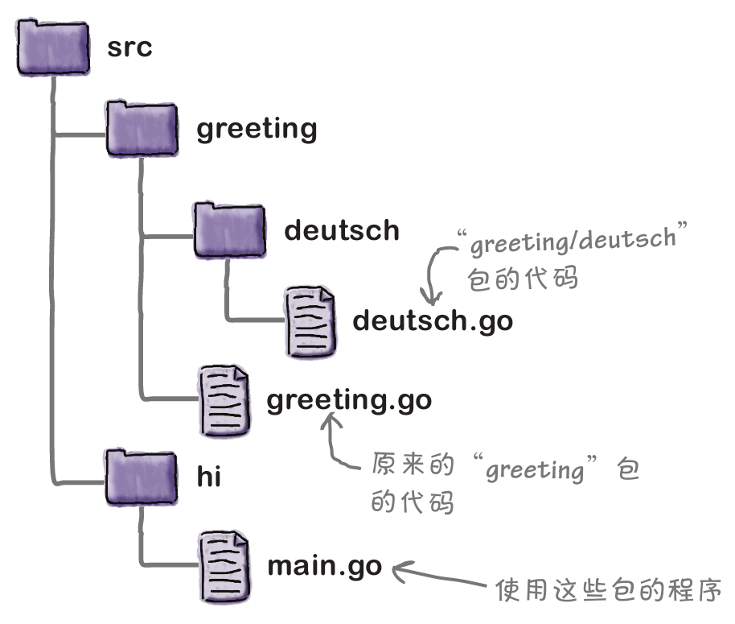

💡如果你的部分代码在多个程序之间共享，你应该考虑将它们移到包中.

---

# go工作区:`GOPATH`
- bin:保存已编译的二进制可执行程序
- pkg:保存已编译的二进制包文件
- src:保存Go的源代码

---

# 按照惯例，包的目录应该与包同名
> main包是个意外:
> 我们希望这是一个可执行的命令，所以需要使用main的包名

---

# 包名命名规范:
1. 包名应全部为小写
2. 如果需要两个词，不应该用下划线分隔，第二个词也不应该大写。（strconv包就是一个例子。）

---

# 包限定符:

从定义它们的同一个包中调用函数 ==> 不需要`包名.函数名` ==> 其他则要


---

# 嵌套包的导入路径

从src下包开始:


导入dutsch.go和greeting.go的包:


---

# 常量
```
const 常量名 类型 = 4 
//变量有:=短变量声明语法，但是常量没有等效的语法

const 常量名 = 4 
//可以省略类型，它将从分配的值推断出来
```

名称以大写字母开头的常量是可导出的

---

# 使用go install

一个常见的约定是使用包所在的URL作为其导入路径。这样在只提供包的导入路径的情况下go get工具就可以查找、下载和安装包。

go install命令也保存编译后的可执行程序的二进制版本，但保存在定义良好、易于访问的位置：Go工作区中的bin目录。


`go install src中文件夹名`

> 会编译文件夹中func main的那个go程序

与go build命令（其以所基于的.go文件来命名可执行文件）不同，而go install命令则以包含代码的目录来命名可执行文件


---

# go get 下载包

go get后面跟着存储库URL，但是“模式”部分（“https：//”）被去掉了
`go get github.com/headfirstgo/greeting`

---

# go doc 显示关于任何包或函数的文档

```go
go doc 包名
go doc 函数名
```

自己写的注释:
- 包注释:应以“Package”开头，后跟包名
- 函数注释


